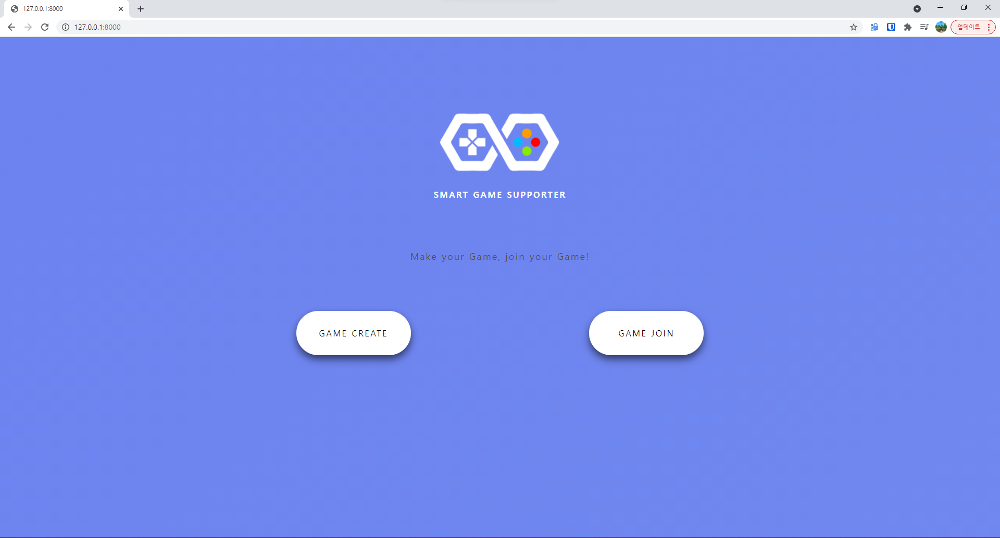
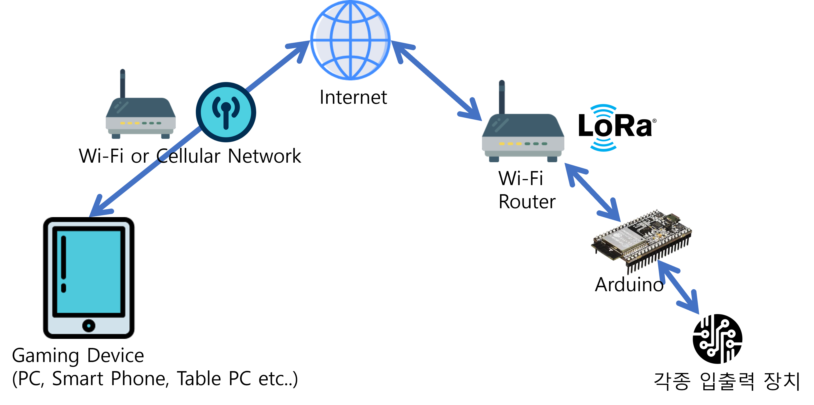
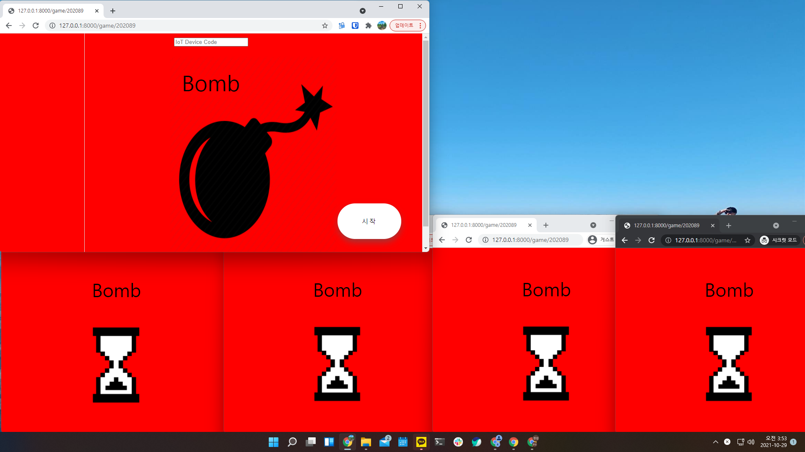
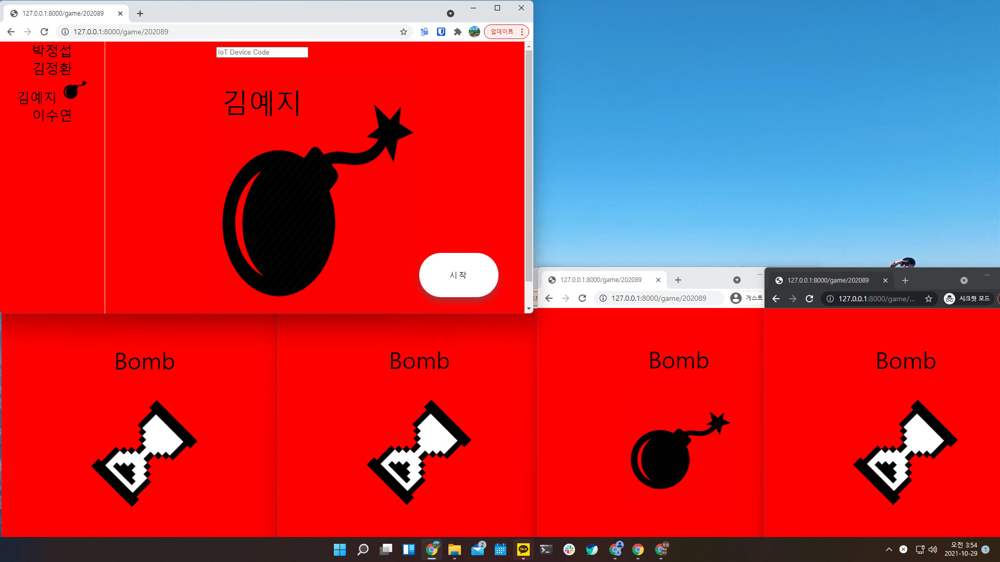
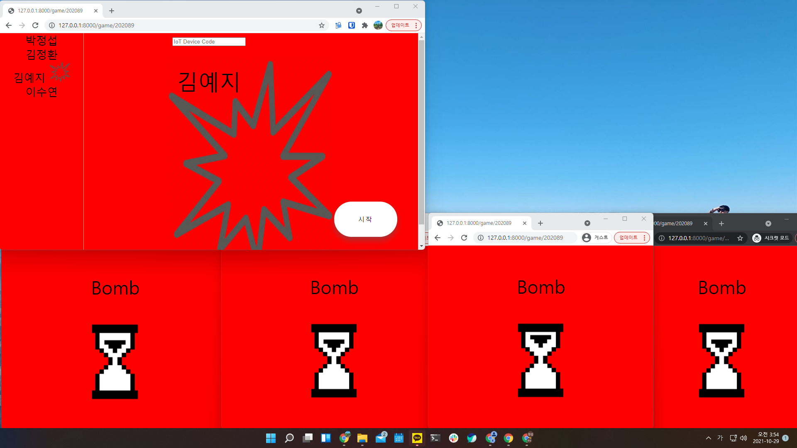
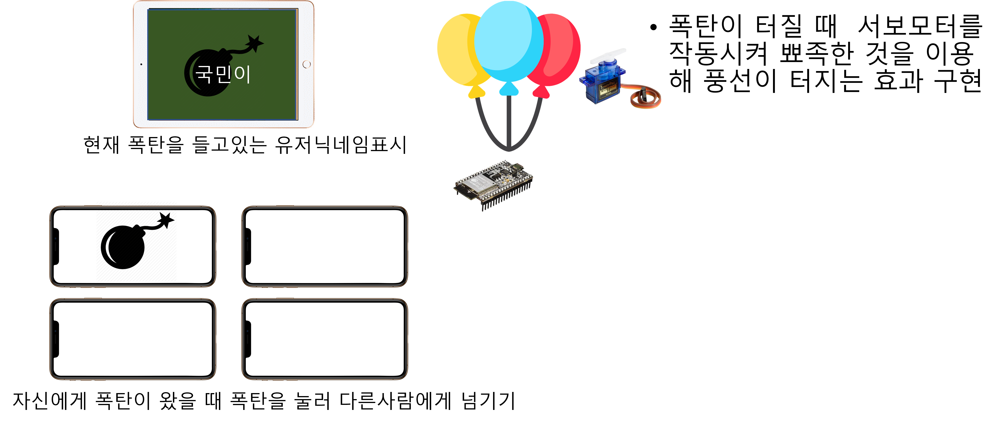
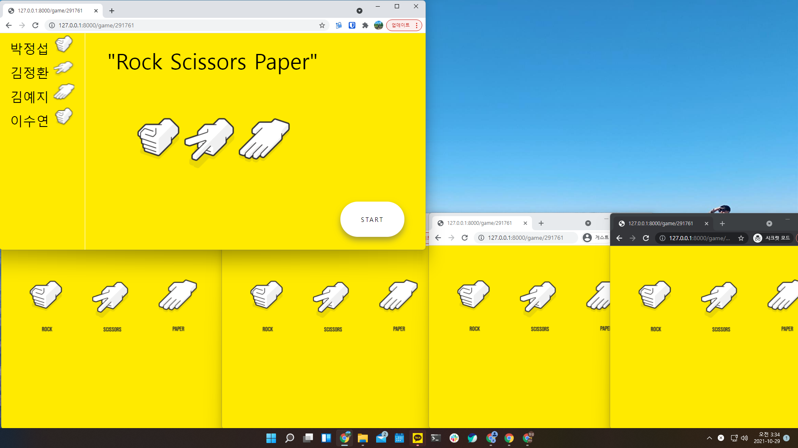
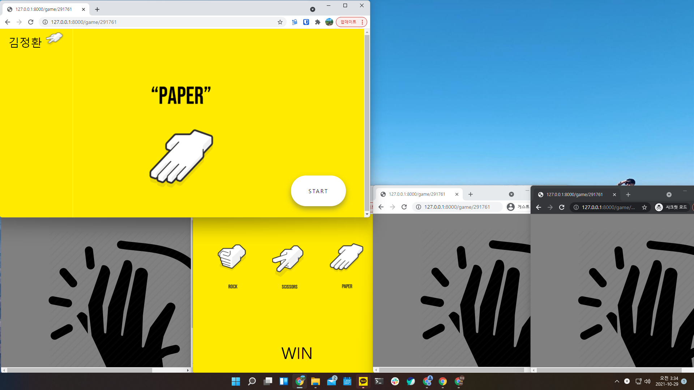
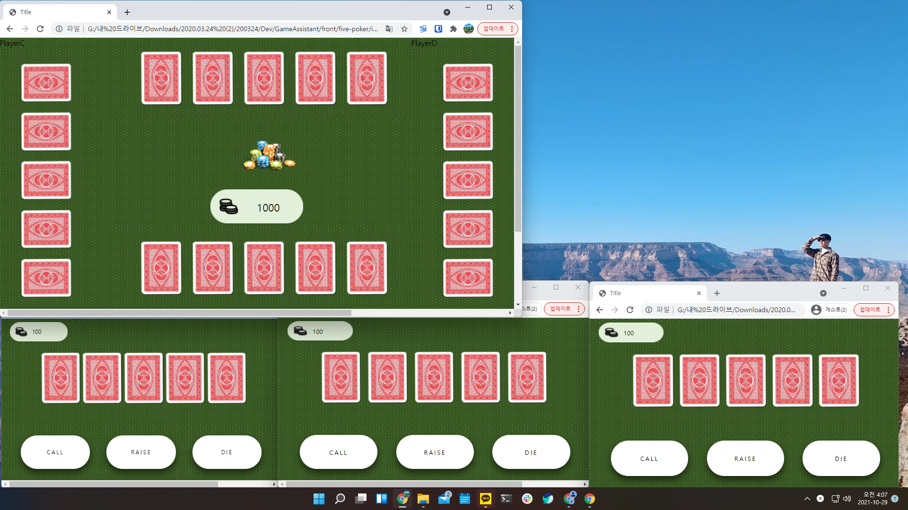
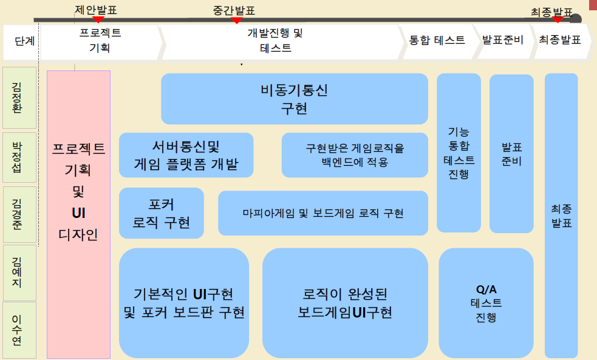

# Smart Game Supporter
오프라인 다인용 게임 어시스트 웹게임플랫폼

오프라인에서 친목도모를 위한 게임진행시 활용할 수 있는 서비스

오픈소스 소프트웨어 5조 2차 프로젝트

# 기능

- 기본적으로 각게임과 SGS플랫폼 분리하여 게임 추가 용이(확장성 확보)
  - 백엔드에서의 게임 로직파트와 프론트엔드의 UI를 구분하여 로직과 프론트엔드 개발로 빠른 게임 확장 가능
- 서버-클라이언트간의 통신은 WebSocket을 이용
- IoT와의 통신도 구현하여 IoT의 클라이언트 플랫폼과 백엔드 서버를 구현하여 IoT기기를 이용한 4D게임 효과 구현

## 메인화면

- 메인페이지에서 공유화면으로서 게임방생성을 선택 혹은 개인기기로 방참가를 선택
  - 공유기기로 게임 방 생성(PC혹은 태블릿PC등 대화면기기 추천)
  - 개인기기로 게임 방 참가

## 게임참가
.png)
- 참가할 방의 코드와 닉네임을 입력하여 게임 대기실에 참가

## IoT를 이용한 게임의 4D효과 구현
### IoT 구조

### IoT 기기 설정

- 아두이노 기반의 SGS게임 연동용 소프트웨어
- 전원을 연결한후 Wi-Fi에서 "SMARTGAMESUPPORTER"를 선택
- 위와 같이 나오는 Captive Portal페이지에서 인터넷에 연결될 Wi-Fi 접속정보와 IoT 기기 코드를 설정
- 저장후 아두이노는 재부팅후 설정한 Wi-Fi에 연결되어 온라인 상태 유지

## 게임 대기실
.png)
- 공유화면으로 쓸 기기에서 방생성하거나 개인기기로 생성된 게임화면의 코드를 입력하여 대기실 접속
- 좌측에 접속한 인원의 닉네임 표시
- 중간 상단에 현재 접속중인 게임방의 코드 표시
- 지원게임들중 선택
- 하단 게임시작 버튼

# 게임

## 폭탄돌리기
### IoT기기 연결

- 게임시작시 IoT기기의 코드를 입력하여 센서 연결 가능

### 인게임 폭탄돌리기중

- 랜덤으로 돌아가는 폭탄이 본인에게 왔을때 폭탄을 터치하여 다른사람에게 토스

### 게임결과

- 랜덤한 시간이 경과하여 폭탄이 터졌을 때 들고있는 사람이 Lose

### 4D효과

- 연결된 아두이노에서 폭탄이 터졌을때 모터를 돌려 바늘로 풍선을 터뜨려 폭탄의 4D효과 구현

[폭탄돌리기 게임 시연영상](https://youtu.be/5Bcre34f8AQ)

[폭탄돌리기 게임 IoT연동 영상](https://youtu.be/WXsf5NI94nE)

## 가위바위보

- 가위바위보 게임에 들어오면 각자 가위, 바위, 보 중에서 선택할 수 있고 선택한 내용은 공유화면에 닉네임과 함께 표시

- 공유화면에서 버튼을 누르면 서버에서 랜덤으로 결과가 정해지고 해당결과에 따라 이긴사람은 남고 진사람은 탈락
- 이긴사람끼리 계속 게임을 이어갈 수 있음

[가위바위보 게임 시연영상](https://youtu.be/0R5xAwK7NLM)

## 포커

- 공유화면을 포커테이블로 활용하여 오픈된 카드 표시
- 개인화면을 통해 본인만 볼 수 있는 히든카드를 표시하고 본인의 턴에 콜, 레이즈, 다이 액션을 취할 수 있음

게임로직 미구현.

## 마피아
공유화면을 통해 마피아게임의 사회자 역할을 하고 개인기기를 통해 직업할당, 투표, 직업역할수행(살인, 수사, 치료 등)

미구현.

# 조원
5조
 - 20153163 김정환 [@JasonKJ](https://github.com/JasonKJ)
 - 20171598 김예지 [@kookminYeji](https://github.com/kookminYeji)
 - 20181616 박정섭 [@ParkJeongseop](https://github.com/ParkJeongseop)
 - 2018???? 김경준 [@celarim](https://github.com/celarim)
 - 20181661 이수연 [@Lsyeon](http://github.com/Lsyeon)

